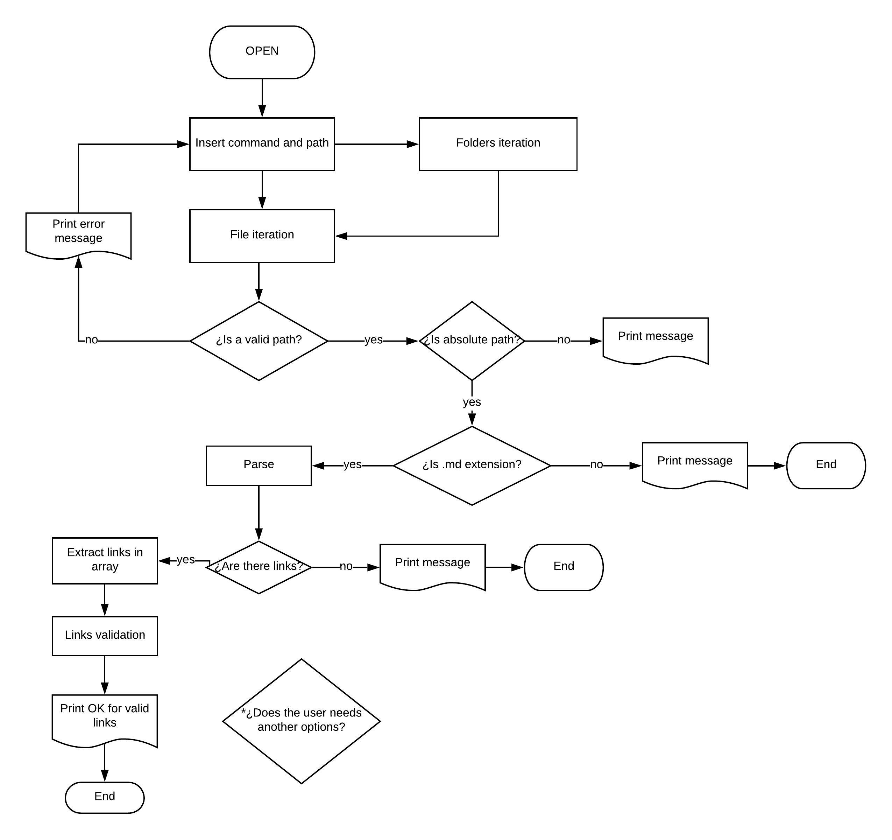
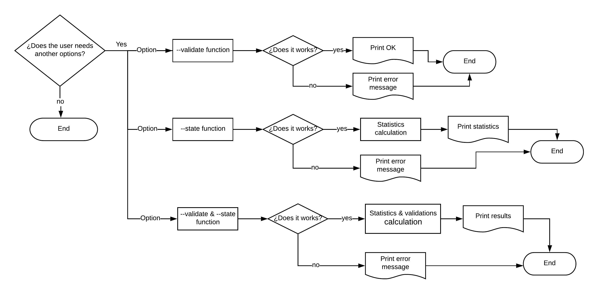
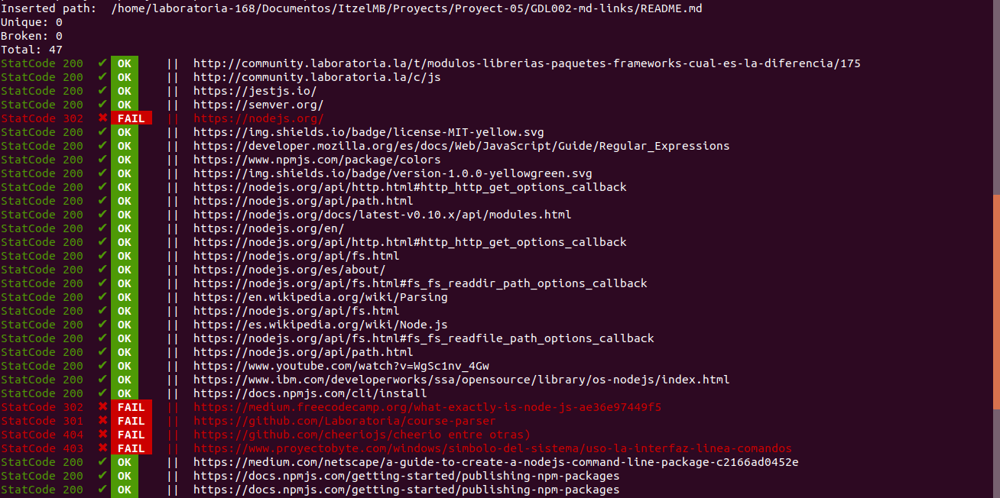
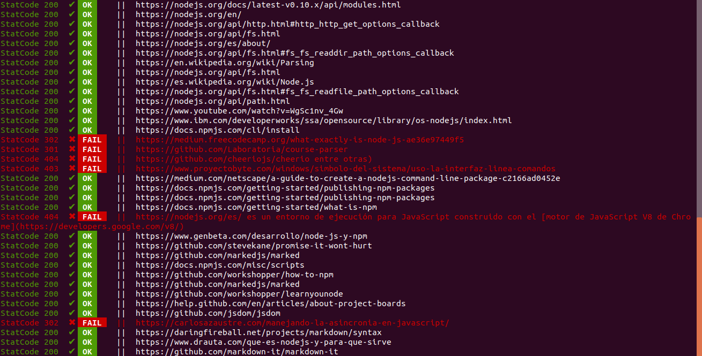

# Md-links


## Description
This is a library for developers, it helps to read and analyze files in Markdown format, also allow verify the links they contain and to report some statistics.

## Flowcharts
These flowcharts show the behaviour in the construction of md-links.

### Default behaviour
You can expect as a default behaviour the result of all the valid and broken links in your md file.



### Options behaviour
You can add options to decide what to do: validate links, get statistics or both of them at the same time.



## Requirements
- Node.js

- Install [Colors](https://www.npmjs.com/package/colors) to better view
>$npm i colors

## Usage
You may insert the name of your file with extension md or a directory that contains md files. Md-links can read windows and linux paths.
If you install "colors" as a result you will see in green color de status code of the link and the "OK" word for valid links. For broken links you will see in red color de status code, also in red the word "FAIL" and the broken link, but if you don't you would see the same information without colors.

```sh
$node md-links <path>
```




## README test
This is a test README.md


```sh
[Markdown]
(https://es.wikipedia.org/wiki/Markdown) es un lenguaje de marcado ligero muy popular entre developers.

Dentro de una comunidad de código abierto, nos han propuesto crear una herramienta usando [Node.js](https://nodejs.org/), que lea y analice archivos
en formato `Markdown`, para verificar los links que contengan y reportar algunas estadísticas.

[Node.js](https://nodejs.org/es/) es un entorno de ejecución para JavaScript construido con el [motor de JavaScript V8 de Chrome](https://developers.google.com/v8/).


Tópicos:

- [Node.js](https://nodejs.org/en/).
- [módulos (CommonJS)](https://nodejs.org/docs/latest-v0.10.x/api/modules.html).
- [file system](https://nodejs.org/api/fs.html).
- [path](https://nodejs.org/api/path.html).
- [http.get](https://nodejs.org/api/http.html#http_http_get_options_callback).
- [Parsing](https://en.wikipedia.org/wiki/Parsing).
- [markdown](https://daringfireball.net/projects/markdown/syntax).
- [CLI](https://www.proyectobyte.com/windows/simbolo-del-sistema/uso-la-interfaz-linea-comandos).
- [npm-scripts](https://docs.npmjs.com/misc/scripts).
- [semver](https://semver.org/).


Los tests unitarios deben cubrir un mínimo del 70% de _statements_, _functions_,_lines_ y _branches_. Te recomendamos explorar [Jest](https://jestjs.io/) para tus pruebas unitarias.

También te sugerimos que empieces a utilizar los [project boards](https://help.github.com/en/articles/about-project-boards) de github que te ayudaran a organizar y priorizar su trabajo.

Con el comando `npm install githubname/reponame` podemos instalar directamente desde GitHub. Ver [docs oficiales de `npm install` acá](https://docs.npmjs.com/cli/install).

Por ejemplo, el [`course-parser`](https://github.com/Laboratoria/course-parser) que usamos para la currícula no está publicado en el registro público de NPM, así que lo instalamos directamente desde GitHub con el comando `npm install Laboratoria/course-parser`.

- Usando un _módulo_ como [markdown-it](https://github.com/markdown-it/markdown-it), que nos devuelve un arreglo de _tokens_ que podemos recorrer para identificar los links.
- Siguiendo otro camino completamente, podríamos usar [expresiones regulares (`RegExp`)](https://developer.mozilla.org/es/docs/Web/JavaScript/Guide/Regular_Expressions).
- También podríamos usar una combinación de varios _módulos_ (podría ser válido transformar el markdown a HTML usando algo como [marked](https://github.com/markedjs/marked)
  y de ahí extraer los link con una librería de DOM como [JSDOM](https://github.com/jsdom/jsdom)
  o [Cheerio](https://github.com/cheeriojs/cheerio) entre otras).
- Usando un _custom renderer_ de [marked](https://github.com/markedjs/marked)
  (`new marked.Renderer()`).

No dudes en consultar a tus compañeras, coaches y/o el [foro de la comunidad](http://community.laboratoria.la/c/js)
si tienes dudas existenciales con respecto a estas decisiones. No existe una
"única" manera correcta :wink:

### Tutoriales / NodeSchool workshoppers

- [learnyounode](https://github.com/workshopper/learnyounode)
- [how-to-npm](https://github.com/workshopper/how-to-npm)
- [promise-it-wont-hurt](https://github.com/stevekane/promise-it-wont-hurt)

### Otros recursos

- [Acerca de Node.js - Documentación oficial](https://nodejs.org/es/about/)
- [Node.js file system - Documentación oficial](https://nodejs.org/api/fs.html)
- [Node.js http.get - Documentación oficial](https://nodejs.org/api/http.html#http_http_get_options_callback)
- [Node.js - Wikipedia](https://es.wikipedia.org/wiki/Node.js)
- [What exactly is Node.js? - freeCodeCamp](https://medium.freecodecamp.org/what-exactly-is-node-js-ae36e97449f5)
- [¿Qué es Node.js y para qué sirve? - drauta.com](https://www.drauta.com/que-es-nodejs-y-para-que-sirve)
- [¿Qué es Nodejs? Javascript en el Servidor - Fazt en YouTube](https://www.youtube.com/watch?v=WgSc1nv_4Gw)
- [¿Simplemente qué es Node.js? - IBM Developer Works, 2011](https://www.ibm.com/developerworks/ssa/opensource/library/os-nodejs/index.html)
- [Node.js y npm](https://www.genbeta.com/desarrollo/node-js-y-npm)
- [Módulos, librerías, paquetes, frameworks... ¿cuál es la diferencia?](http://community.laboratoria.la/t/modulos-librerias-paquetes-frameworks-cual-es-la-diferencia/175)
- [Asíncronía en js](https://carlosazaustre.com/manejando-la-asincronia-en-javascript/)
- [NPM](https://docs.npmjs.com/getting-started/what-is-npm)
- [Publicar packpage](https://docs.npmjs.com/getting-started/publishing-npm-packages)
- [Crear módulos en Node.js](https://docs.npmjs.com/getting-started/publishing-npm-packages)
- [Leer un archivo](https://nodejs.org/api/fs.html#fs_fs_readfile_path_options_callback)
- [Leer un directorio](https://nodejs.org/api/fs.html#fs_fs_readdir_path_options_callback)
- [Path](https://nodejs.org/api/path.html)
- [Linea de comando CLI](https://medium.com/netscape/a-guide-to-create-a-nodejs-command-line-package-c2166ad0452e)
```